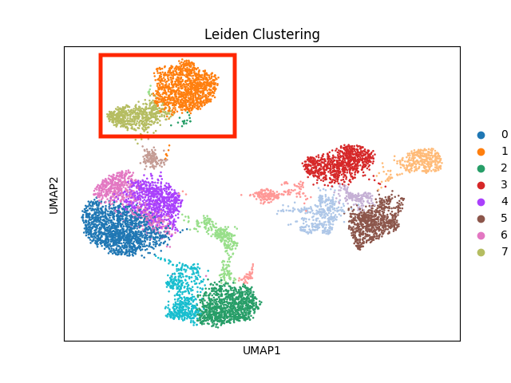
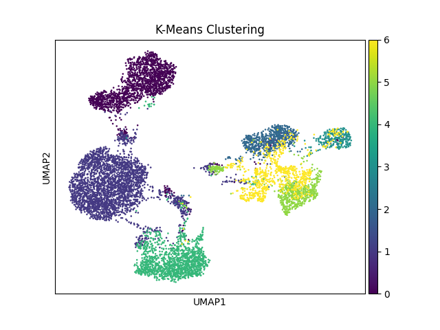

# CSE185_FinalProject
 
This project focuses on the analysis of single-cell RNA sequencing (scRNA-seq)
data using various clustering methods. The primary objective is to identify 
and visualize clusters of cells based on their gene expression profiles.





A general workflow would involve importing the data, running some preprocessing and doing dimensionality reduction with PCA.
Once that done, you can run `clusterings.py` and select different clustering methods and finally visualize the result by UMAP or tSNE.

## **Installation Guide**

In Jupyter Notebook, using the following command to install it.

```sh
!pip install git+https://github.com/ShiyuanWen/CSE185_FinalProject.git
```

Then, you can call the methods in the package after importing them.

```sh
from scRNA_clusterings import (
    kmeans_clustering, hierarchical_clustering, leiden_clustering,
    sc3s_clustering, benchmark_clustering, visualize_clustering
)
```

In local machine, using the following command to install it.
The required packages are ***scanpy
anndata
matplotlib
seaborn
leidenalg
sc3s
scikit-learn***
```sh
git clone https://github.com/ShiyuanWen/CSE185_FinalProject.git
cd CSE185_FinalProject
pip install -e .
```

Then, in your python script, call the methods in the package

```sh
from scRNA_clusterings import (
    kmeans_clustering, hierarchical_clustering, leiden_clustering,
    sc3s_clustering, benchmark_clustering, visualize_clustering
)
```

## Usage
This project is designed to be an intermediate step in single cell analysis workflow.
It provides various different clustering methods after performing dimensionality reduction.
A general workflow would be similar to what we have done in CSE 185 lab6. For testing purpose,
[a harmony-processed PCA object](https://github.com/ShiyuanWen/CSE185_FinalProject/blob/main/benchmarking/harmony_integrated.h5ad)
can be used to test those functions. 

In your python script, after performing PCA, apply 

```sh
sc.pp.neighbors(adata_var)
```

and we can select different clustering methods such as ***kmeans_clustering, hierarchical_clustering, leiden_clustering,
    sc3s_clustering***

Then, we can quantitatively analyze the quality of different clustering methods by calling
***benchmark_clustering***

Finally, we can visualize the result in tSNE or UMAP by calling ***visualize_clustering***

## Parameter

The `scRNA_clusterings` package provides several clustering methods for single-cell RNA sequencing data. Below are the available functions and their parameters.

### Functions

#### `kmeans_clustering`

Performs K-means clustering on the data.

**Parameters:**
- `adata` (AnnData): The annotated data matrix.
- `n_clusters` (int): The number of clusters.

**Returns:**
- `np.ndarray`: Cluster labels.

#### `hierarchical_clustering`

Performs hierarchical clustering on the data.

**Parameters:**
- `adata` (AnnData): The annotated data matrix.
- `n_clusters` (int): The number of clusters.

**Returns:**
- `np.ndarray`: Cluster labels.

#### `leiden_clustering`

Performs Leiden clustering on the data.

**Parameters:**
- `adata` (AnnData): The annotated data matrix.
- `resolution` (float, optional): The resolution parameter. Higher values lead to more clusters. Default is 1.0.

**Returns:**
- `np.ndarray`: Cluster labels.

#### `sc3s_clustering`

Performs SC3S clustering on the data.

**Parameters:**
- `adata` (AnnData): The annotated data matrix.
- `n_clusters` (int): The number of clusters.

**Returns:**
- `np.ndarray`: Cluster labels.

#### `benchmark_clustering`

Evaluates the clustering performance using [silhouette scores](https://en.wikipedia.org/wiki/Silhouette_(clustering)#:~:text=The%20silhouette%20score%20is%20specialized,distance%20or%20the%20Manhattan%20distance.).

**Parameters:**
- `adata` (AnnData): The annotated data matrix.
- `labels` (np.ndarray): Cluster labels.

**Returns:**
- `float`: Silhouette score.

#### `visualize_clustering`

Visualizes the clustering results using UMAP.

**Parameters:**
- `adata` (AnnData): The annotated data matrix.
- `labels` (np.ndarray): Cluster labels.
- `title` (str): Title for the plot.
- `method` (str, optional): Method for visualization. Can be 'umap' or 'tsne'. Default is 'umap'.

**Returns:**
- `None`: Displays the plot.

