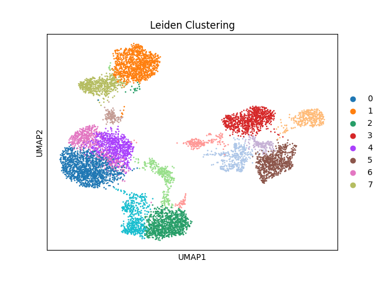

# CSE185_FinalProject
 
This project focuses on the analysis of single-cell RNA sequencing (scRNA-seq)
data using various clustering methods. The primary objective is to identify 
and visualize clusters of cells based on their gene expression profiles.

A general workflow would involve importing the data, running some preprocessing and doing dimensionality reduction with PCA.
Once that done, you can run `clusterings.py` and select different clustering methods and finally visualize the result by UMAP or tSNE.
